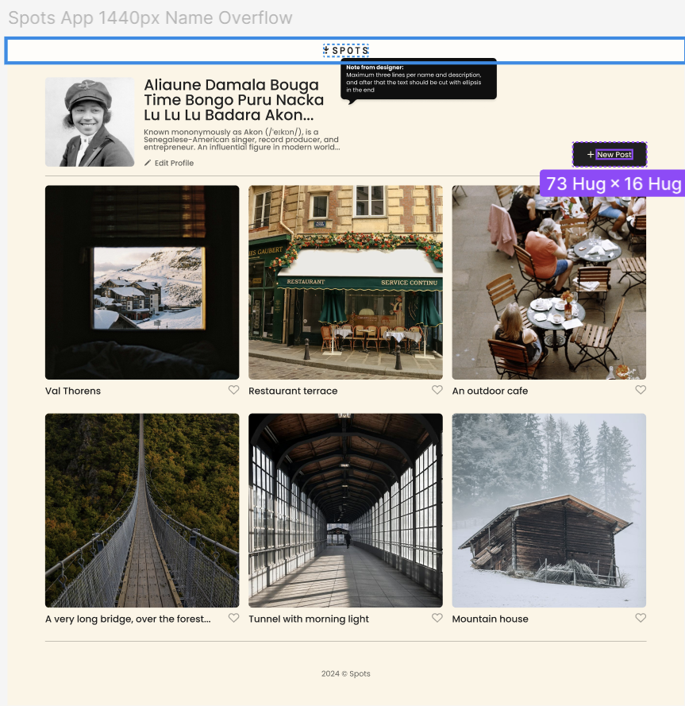

# Spots

## This project's function is to showcase my knowledge of responsive layout design between softwares. Within the page you will notice responsive grid CSS, structured BEM filing, and easy-to-access paths for efficient web performance.

## @import, and @media CSS were used as a relative substitute to link tags. It also prioritizes Figma prototype to VS Code integrations. Alot of the font properties, margins, and padding were directly referenced from the figma design provided...

[spots page web-link](https://simehale.github.io/se_project_spots/)
